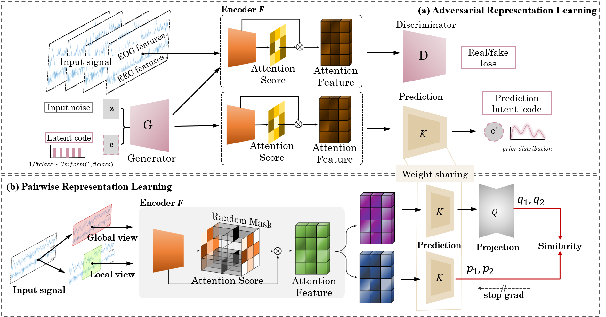

# SSLLAP
This repository contains the code of [SSLAPP] 
Self-Supervised Learning with Attention-based Latent Signal Augmentation for Sleep Staging with Limited Labeled Data

If the code or the paper has been useful in your research, please add a citation to our work: 

# Dependencies
- CPU or NVIDIA GPU
- Python 3.9.7 x64
- pytorch 1.11.0 
- numpy 1.21.5
- scikit-learn 1.0.2 
- scipy 1.8.0

# Datasets 

- Dataset used in our paper, [SleepEDFX](https://www.physionet.org/content/sleep-edfx/1.0.0/) and [ISRUC](https://sleeptight.isr.uc.pt/?page_id=48) can be downloaded from [here](https://drive.google.com/drive/folders/1p2_CExyUa_jjByPI2c8ElyrrdHTwKnAY?usp=sharing). 
- Each data is sliced as segments composed of one epoch (30 seconds).
- 2 channels, EEG and EOG are used in our research.
- 'EEG_train' and 'EOG_train' in SleepEDFX is used for representation learning, and the others as finetuning and evaluation.

# Training
In order to train a model for SSLLAP, use main.py script. 
Following are the main parameters for training:
<pre><code>
--klwt : importance of pair wise representation loss 
--segment : number of segment you want to use
--lambda_g : importance of global loss
--lambda_l : importance of local loss
</code></pre>

For example, to train our model, use the following: 
<pre><code>
python main.py --klwt 10 --segment 6 --lambda_g 0.5 --lambda_l 0.5
</code></pre>

# Evaluation
After the representation learning stage, use finetune.py to evaluate our model.
<pre><code>
python finetune.py
</code></pre>
